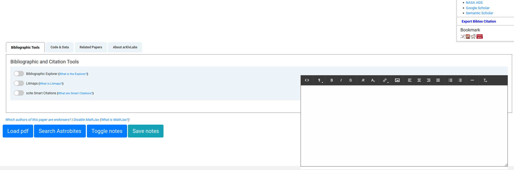

# arxiv-toolbox

In order to install this extension on firefox: 
- <a href="https://github.com/kvgc/arxiv-toolbox/raw/main/6b69b54109ef43658ad4-0.1.0.xpi">Click here to download .xpi file to disk</a>
- Open the xpi file with firefox 
- Follow instructions to install

To use extension, open any arxiv page, you should see two buttons (Open pdf, Search astrobites) on the bottom left and a note editor on the bottom right. See screenshot below: 

### Demo

